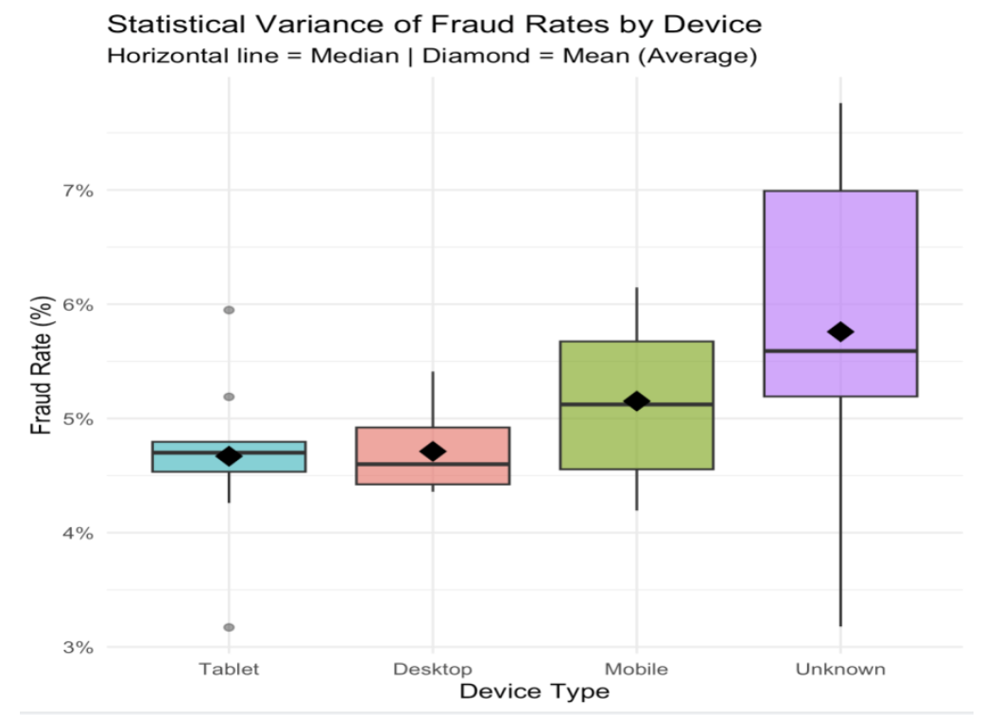
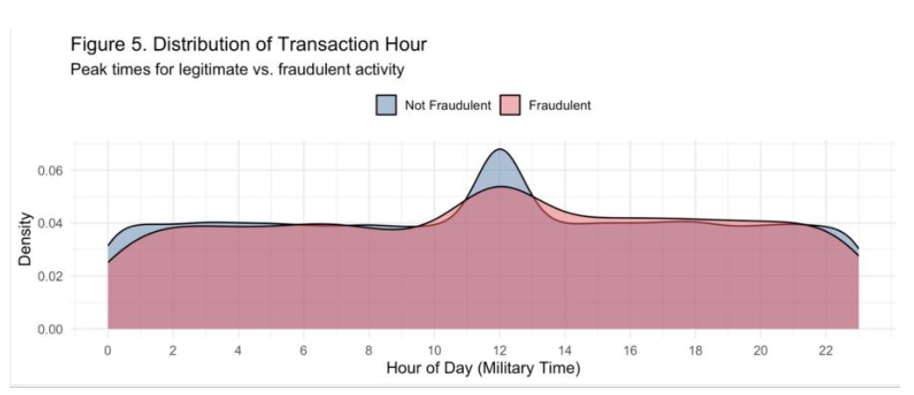

## 1. ANOVA Analysis: Device Type and Fraud Rates
### Hypothesis Testing
* [cite_start]**Null Hypothesis ($H_0$):** The mean fraud rate is equal across all device types[cite: 4].
* **Alternative Hypothesis ($H_1$):** At least one device type has a significantly different mean fraud rate[cite: 5].

### Findings & Statistical Variance
* **"Unknown" Devices:** Exhibit the highest average (mean) fraud rate and the largest variance[cite: 17]. This marks them as the most unpredictable and critical risk category[cite: 17].
* [cite_start]**Mobile Devices:** Follow "Unknown" sources, demonstrating a higher median fraud rate than Desktop and Tablet devices[cite: 18].
* [cite_start]**Desktop & Tablet Devices:** Remain the most stable, tightly bound, and low-risk transaction channels[cite: 18].

### Strategic Recommendation
* Implement stricter multi-factor authentication (MFA) and verification protocol steps for "Unknown" sources to minimize economic losses and enhance transaction security[cite: 19].

---

## 2. ANOVA Analysis: Time of Day and Fraud Distribution
### Hypothesis Testing
* [cite_start]**Null Hypothesis ($H_0$):** The mean fraud rate is equal across all time periods (Morning, Afternoon, Evening, Night)[cite: 21].
* **Alternative Hypothesis ($H_1$):** At least one time period has a significantly different mean fraud rate[cite: 22].

### Findings & Distribution Dynamics
* **Evening Period:** Shows the highest median and mean fraud rates across the dataset[cite: 37].
* [cite_start]**Morning & Afternoon Periods:** Display the greatest variance and wider Interquartile Ranges (IQR), indicating less predictable behavior during daylight hours[cite: 37].
* [cite_start]**Nighttime Transactions:** Appear as the most stable window, showing the lowest overall fraud distribution[cite: 38].
* **Hourly Insights:** Based on operational transaction density (Military Time), fraud density begins picking up relative to legitimate transactions during non-business hours, specifically starting after hour 16:00[cite: 126].

### Strategic Recommendation
* [cite_start]Deploy time-based velocity checks and automated transaction limits during evening peak hours to actively flag and intercept high-frequency anomalies[cite: 39].

---

## 3. Regression Analysis (Model 1): Fraud Risk Shift by Amount Tier
### Model Framework
* [cite_start]**Response Variable:** `fraudulent` (The predicted probability of a transaction being fraud) [cite: 57]
* **Predictor:** `is_high_value` (Categorized as Low Range $<\$25\text{k}$ or High Range $>\$25\text{k}$) [cite: 58]

### Statistical Metrics
* [cite_start]**P-value:** $0.149$ [cite: 62]
* [cite_start]**F-statistic:** $2.081$ [cite: 67]
* **Adjusted $R^2$:** $0.000$ [cite: 69, 70]

### Findings & Valuation Impact
* [cite_start]Moving from the low-value to the high-value tier indicates a directional upward trend, shifting the predicted fraud probability from approximately $4.9\%$ to $6.3\%$ [cite: 53] [cite_start](an increase of $1.39$ percentage points [cite: 60]).
* However, the model's $p$-value ($0.149$) reveals that within this simple single-variable framework, the amount tier alone is **not statistically significant** at the $95\%$ confidence level[cite: 62].
* [cite_start]The Adjusted $R^2$ of $0.000$ confirms that transaction size alone explains a negligible portion of total fraud variance[cite: 69, 70]. [cite_start]This underscores that fraud is driven by an intersection of variables rather than isolated dollar thresholds[cite: 70].
* A widening confidence interval in the higher tier indicates greater statistical uncertainty for larger amounts[cite: 54].

### Strategic Recommendation
* [cite_start]Establish tiered verification thresholds for transactions exceeding $\$25,000$ to control for the baseline directional risk elevation[cite: 55].

---

## 4. Regression Analysis (Model 2): Multi-Factor & Interaction Effects
### Model Framework
* [cite_start]**Response Variable:** `fraudulent` (Predicted fraud probability) [cite: 92]
* **Predictors:** `transaction_amount`, `device_used` (Desktop, Mobile, Tablet, Unknown), and `previous_fraudulent_transactions` [cite: 92, 96]
* [cite_start]**Interaction Term:** `device_used:transaction_amount` (Evaluates how fraud risk changes as transaction amounts increase across different devices) [cite: 93]

### Equation Structure
$$\text{Predicted Fraud Probability} = \beta_0 + \beta_1(\text{Amount}) + \beta_2(\text{Device}) + \beta_3(\text{PrevFraud}) + \beta_4(\text{Amount} \times \text{Device})$$

### Statistical Significance & Model Accuracy
* **Predictor Success:** `transaction_amount`, `device_used`, and `previous_fraudulent_transactions` are all highly statistically significant predictors of fraud[cite: 95, 96].
* [cite_start]**Interaction Success:** The interaction effect between `device_used` and `transaction_amount` is statistically significant ($p < 0.05$)[cite: 99]. [cite_start]This mathematically confirms that the impact of transaction size on fraud risk varies sharply depending on the channel used[cite: 99].
* **Model Validation:** The significant F-statistic validates that this multi-factor model is a legitimate upgrade over baseline average guesses, proving a true mathematical relationship rather than random variance[cite: 102, 103].

### Behavioral Divergences
* [cite_start]**"Unknown" Devices:** Exhibit the steepest upward slope, with fraud probability spiking dramatically toward $14\%$ as transaction amounts increase[cite: 89].
* [cite_start]**Mobile Devices:** Risk scales upward consistently alongside higher spending amounts[cite: 90].
* **Tablet Devices:** Risk remains relatively flat, showing a marginal upward trajectory.
* [cite_start]**Desktop Devices:** Demonstrate a unique inverse relationship; risk actually trends downward as transaction sizes increase, suggesting larger value purchases are safer on traditional computers[cite: 90].

### Strategic Recommendation
* [cite_start]Prioritize high-value "Unknown" and "Mobile" transactions for escalated security checks, as the interaction model proves they grow exponentially riskier at higher price points[cite: 91].

---

## 5. Account Maturity Metrics: Influence of Account Age
### Findings & Timeline Dynamics
* Analysis of account age densities reveals a noticeable distribution shift: older accounts show an increased probability of fraudulent transactions[cite: 145].
* [cite_start]A pronounced risk spike is visible within the **75–100 day range**[cite: 145]. [cite_start]This indicates that as accounts mature, they face a higher compounding probability of credential stuffing, account takeovers, or delayed-execution breaches by malicious actors[cite: 145].
